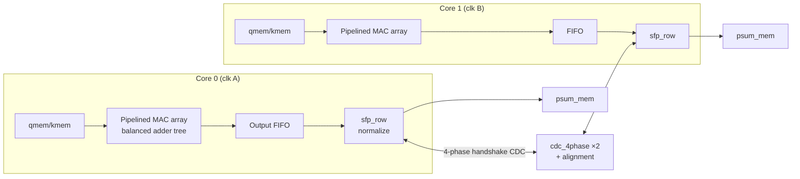
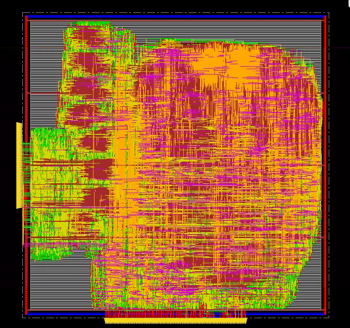
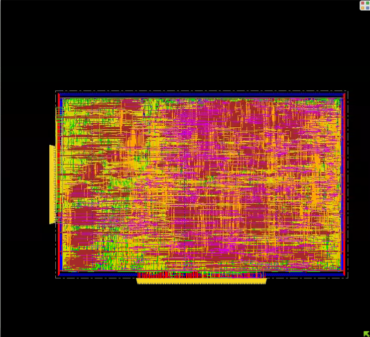

# Dual-Core Attention Accelerator — RTL to GDSII on TSMC 65 nm

> A dual-core machine-learning accelerator for the attention mechanism (Q·K row scoring),
> taken through the full digital flow — RTL design, synthesis, hierarchical place-and-route,
> and sign-off checks — at a **1 GHz target clock** on TSMC 65 nm (tcbn65gplus).
> Course project, ECE 260B (VLSI Digital IC Design), UC San Diego, Winter 2026 — team of six.
> **This repo documents the design and my ongoing solo optimization work on it (see [Roadmap](#roadmap)).**

## Highlights

| Metric (dual-core, post-route) | Value |
|---|---|
| Technology | TSMC 65 nm GP (tcbn65gplus) |
| Target clock | 1 GHz (1.0 ns) |
| Area | 283,408.92 µm² |
| Total power | 580.99 mW |
| Post-route worst setup slack | −0.070 ns |
| DRC | **Clean — 0 violations** (Innovus verify_drc) |
| Sparsity-aware revision (row-skip) | 580.99 mW → 212.67 mW estimated (−63.4 %)* |

\* Honest footnote: the baseline is post-route power; the sparsity revision's figure is a
post-synthesis estimate — its full place-and-route is exactly what the roadmap below is
completing. Numbers are reported as measured, stage labels included.

## Architecture

Each core computes signed 8-bit 8×8 query–key dot products on a pipelined MAC array,
accumulates row scores, and normalizes them in fixed point (`sfp_row`: absolute row sum,
shift-by-8 precision preservation, division). The two cores run in **separate clock
domains** and exchange normalization data through a **4-phase handshake CDC**
(`cdc_4phase`) with alignment logic, so the merged denominator meets the divide stage on
the correct cycle.



**Optimization work** (report §8): deeper MAC pipelining, linear reduction path → balanced
adder tree, clock gating with enable flops on inactive logic, deeper FIFO + wider mux to
absorb the added latency, and cross-core signal alignment.

**Sparsity-aware revision** (report §9): row-level skip — accumulated row score
`S_i = Σ|Q_i·K_j|` compared against a threshold chosen at the 30th percentile by a Python
reference model; rows below threshold are skipped and written back as zero, verified
cycle-by-cycle against the reference.

## Implementation results

| Design stage | Area (µm²) | Total power (mW) | Post-route WNS (ns) |
|---|---|---|---|
| Flat single core | 119,724.48 | 60.38 | −0.021 |
| Hierarchical single core | 287,419.32 | 685.38 | −0.831 |
| **Dual core (final)** | **283,408.92** | **580.99** | **−0.070** |

Dual-core physical stats: 1,083,083 µm routed wire, 476,844 vias (64.7 % multi-cut),
DRC clean across all 66 sub-areas.

<p align="center">
  
  
</p>

Functional correctness was verified at every stage against testbench golden outputs
(behavioral, post-synthesis, and gate-level; waveforms in `figs/`).

## Roadmap

The course delivered a working 1 GHz dual-core flow with WNS at −0.070 ns. I am closing
the remaining gap as an ongoing weekly project:

- [x] **W1 — metric mining**: consolidated per-stage timing/power/area/DRC evidence
- [ ] **W3 — baseline reproduction**: re-run the flow, reproduce −0.070
- [ ] **W4 — diagnosis**: critical-path breakdown (MAC datapath vs normalization vs CDC), 3 fix hypotheses
- [ ] **W5–W7 — experiments**: synthesis constraints/retiming → floorplan/utilization sweep → CTS useful skew / NDR
- [ ] **W8 — sign-off**: best combination re-run; goal WNS ≥ 0, and full PnR of the
      sparsity revision so its power number becomes a same-stage measurement

Every experiment gets logged here with before/after numbers — process over conclusions.

## Repo contents

```
rtl/        Team RTL; my contributions are the optimization passes (pipelining, adder tree, gating, FIFO)
scripts/    Synthesis / floorplan / CTS / route Tcl (PinPlacement, initialFloorplan, clock, route)
figs/       Layouts, waveforms, report screenshots
docs/       Final report (PDF, de-identified public copy)
```

**Not included**: TSMC PDK, standard-cell libraries (.lib/.lef/.db), gate-level netlists
mapped to foundry cells, and any foundry-licensed files — these never leave the
university environment. Everything else is published with course permission.

## My role

Within the six-person team, my two focus areas were **RTL optimization** and the
**complete physical design flow**. On the RTL side I drove the optimization passes in
report §8 — deeper MAC pipelining, restructuring the linear reduction into a balanced
adder tree, clock gating with enable conditions, and the FIFO/buffering adjustments that
absorb the added pipeline latency. On the backend side I ran the **full flow end to end**:
Design Compiler synthesis, floorplan and pin placement, placement, clock tree synthesis,
routing, and post-route timing/power/DRC sign-off in Innovus.

## Tools

Synopsys Design Compiler (K-2015.06) · Cadence Innovus 15.23 · Xcelium/ModelSim ·
TSMC 65 nm GP · Python (sparsity reference model)

---
*ECE 260B, UC San Diego, Winter 2026. Team project (six members, unnamed here by choice);
my individual contributions are described under [My role](#my-role).*
