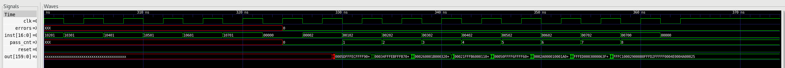
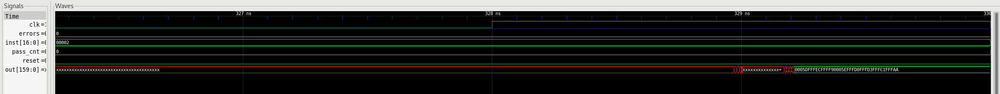

# Step 1 - Single-Core Q x K^T

First entry in the rebuild series. The course supplies a template with a 16-input MAC and
an unconnected core output; this step turns it into a working single-core matrix
multiplier, verifies it, and takes it through synthesis.

**Status: complete.** RTL, behavioral simulation, synthesis, place-and-route at a 1 GHz
target, signoff checks, and SDF-annotated gate-level simulation (8/8 rows correct) have
all been run and verified. The gate-level bring-up surfaced three genuine
tool-and-methodology problems - none of them RTL bugs - and the section on it below
documents all three, because finding them was most of the work.

## What this step computes

`[Q0, Q1, ... Q7]^T * [K0, K1, ... K7]`, where every Qi and Ki is an eight-element vector
of 8-bit signed integers. One row of results per cycle: `Q0.K0 .. Q0.K7` on the first
cycle, `Q1.K0 .. Q1.K7` on the next, and so on.

## Architecture


A K-stationary systolic array. Each of the eight `mac_col` units latches one key vector
and holds it; query vectors then flow across the array, neighbour to neighbour, one column
per cycle. Each column computes an eight-element dot product and pushes it into its own
lane of the output FIFO.

The FIFO exists because of that flow: column j sees a given query vector j cycles after
column 0 does, so the eight partial results for one row arrive skewed. The FIFO absorbs
the skew and lets a complete row be written to `pmem` in a single cycle.

Widths: one element is 8 bits, one vector is `pr * bw` = 64 bits, one dot product is
`bw_psum` = 20 bits, and one row is `col * bw_psum` = 160 bits.

## What changed from the template

The template is a backbone, not a working design. Three things had to be fixed.

**The MAC is 16-input and the project needs 8.** `pr` went from 16 to 8 across
`fullchip.v`, `core.v`, `mac_array.v`, `mac_col.v` and the testbench, and `mac_8in.v` was
written to replace `mac_16in.v`. The module could not simply be re-parameterized: its body
hardcodes sixteen products, so with `pr = 8` it would index past the end of its own ports.

**The core output was not connected.** `core.out` was declared but never driven, and
`fullchip` had no output port at all. This is the trap the course spec warns about: with
nothing observable at the boundary, synthesis removes the entire design as dead logic and
reports near-zero area and power without any error. `pmem` now drives `core.out`, and
`fullchip` exports it.

**The testbench skipped data it should have read.** Both read loops began with four
`$fscanf` calls meant to discard header lines, but `qdata.txt` and `kdata.txt` have no
header - the first line is data. Left alone, those calls consume four real numbers and
shift every vector. The packing loops also wrote sixteen elements into a bus that is now
only eight elements wide.

A readout phase and a self-check were added to the testbench: after the results are
drained into `pmem`, each row is read back out through the chip output port and compared
against the value the testbench computed independently.

## Instruction encoding

| bits | name | effect |
|---|---|---|
| 16 | `ofifo_rd` | pop the output FIFO |
| 15:12 | `qkmem_add` | address for `qmem` and `kmem` |
| 11:8 | `pmem_add` | address for `pmem` |
| 7 | `execute` | run the array |
| 6 | `load` | load keys; also selects `kmem` over `qmem` at the array input |
| 5:4 | `qmem_rd`, `qmem_wr` | |
| 3:2 | `kmem_rd`, `kmem_wr` | |
| 1:0 | `pmem_rd`, `pmem_wr` | |

The testbench drives these directly. An on-chip controller is step 5 work.

## Behavioral results

```
##### RESULT: 8 PASS / 0 FAIL #####
```

All eight rows read back out of `pmem` match the expected products bit for bit. The first
row is `Q0.K0 = 93 = 0x5D`, which appears as the leading `0005d` of

```
0005dfffecffff90005efffd0fffd3fffc1fffaa
```

Simulated with Icarus Verilog, which needs no tool license.

## Synthesis results

Design Compiler Q-2019.12-SP5-3, TSMC 65nm, worst-case corner (`tcbn65gpluswc`, 0.9 V),
1.0 ns target.

| metric | value |
|---|---|
| Cell area | 148,885.20 um2 |
| Total power | 59.0083 mW (57.7193 dynamic + 1.2891 leakage) |
| Setup WNS | -0.64 ns |
| Setup TNS | -1235.51 ns over 2699 violating paths |
| Hold | 0 violations |
| Levels of logic | 17 |
| Leaf cells | 28,972 (8,624 sequential, 20,348 combinational) |
| Max transition / max capacitance violations | 0 / 0 |

Reading these numbers honestly requires three caveats.

**The SRAMs are behavioral models here, so synthesis turns them into flip-flops.** Macro
count is zero and registers account for 94.9% of the power. Turning the memories into real
macros is step 3, and the area and power profile will change completely when that happens.

**Clock network power reads as zero** because the clock is ideal at this stage. Clock tree
synthesis happens during place-and-route, and will add to the total.

**Power is a statistical estimate.** No switching activity file was annotated, so the
figure comes from default toggle rates rather than from the simulation.

`set_false_path -from [get_ports reset]` is applied in the SDC. Reset is synchronous and
fans out to every flip-flop in the design; timing it wastes optimization effort on a path
that is only released once, and it inflates the buffer tree. The constraint is confirmed
active by `report_timing_requirements`.

### What the timing numbers say

2699 violating paths at an average of about -0.46 ns is not one slow path - it is the
whole datapath being uniformly too slow. The critical path runs from a key register in one
`mac_col`, through the eight multipliers and the adder tree, into the output FIFO: 17
levels of combinational logic in a single cycle, with no pipelining anywhere.

The course spec allows step 1 to miss 1 GHz, so this is an accepted result rather than a
failure. It is also the baseline the optimization steps will be measured against, and it
points at pipelining the MAC as the first thing to try.

## Re-synthesis: making the resets X-safe

Gate-level simulation (below) exposed that Design Compiler had factored the synchronous
reset of several uniquified modules through shared product terms. That implementation is
two-state equivalent to the RTL - real silicon resets fine, and equivalence checking
would pass - but in four-state simulation an all-X power-up state gates the reset off
and the register locks at X forever.

The documented cure is the `sync_set_reset` compiler directive, one comment line in each
module that carries a synchronous reset (`mac_col.v`, `fifo_depth16.v`, `sfp_row.v`).
It tells DC the signal is a reset, and DC then maps the registers onto synchronous-clear
flops, where reset dominance is built into the cell. The synthesis table above is from
the first netlist and was not re-measured at the synthesis stage; the place-and-route
numbers below are from the re-synthesized netlist, and the measured cost of the
directive was small and partly negative: register-to-register WNS improved by 45 ps,
instance count dropped by 331 and power by 1.7%, while the already-known output-path
bottleneck lost 50 ps and eight 2 ps hold violations appeared.

## Place-and-route results

Innovus 21.10-p004_1, same 65nm library, 1.0 ns clock target. The flow is the course
one: floorplan with power ring and stripes, pin placement (inputs west on M3, outputs
south on M2), timing-driven placement, CCOpt clock tree synthesis, routing with RC
extraction, and post-route setup and hold optimization.

| metric | value |
|---|---|
| Setup WNS / TNS | -0.401 ns / -173.714 ns over 1,831 paths |
| ... register-to-register only | -0.125 ns (internal logic closes at ~890 MHz) |
| ... output-port group only | -0.401 ns, all 160 `out` bits |
| Hold WNS | -0.002 ns over 8 paths |
| Instances | 47,243 (39,347 logic + 7,896 filler and decap) |
| Core density | 60.8% (89.0% counting fillers) |
| Clock skew / insertion delay | 0.857 ns / 0.814 ns avg, 1.246 ns max (8,624 sinks) |
| Congestion overflow | 0.00% H, 0.00% V |
| Total power | 171.9 mW at 0.9 V (clock network 17.5 mW) |
| Total wire length | 701,905 um |
| Core / chip area | 298,661 / 320,921 um2 |

Signoff: DRC 0, connectivity 0, PG shorts 0, antenna 0, tie violations 0, glitch 0.
Metal density reports 9,895 windows under the minimum because metal fill is not part of
the course flow; that is a manufacturing step, not a functional one.

Three honest notes. The worst setup number is not the datapath: register-to-register
paths miss 1 GHz by only 125 ps, while all 160 output-port paths sit at -0.401 ns
because the outputs leave the chip unregistered - the optimizer cannot fix that, and
adding an output register stage is already on the step 5 list. The eight hold
violations are 2 ps each and belong to the same later cleanup. Power is still a
statistical estimate; measuring it against real switching activity from the gate-level
VCD is a planned follow-up.

## Gate-level simulation

```
##### RESULT: 8 PASS / 0 FAIL #####
```

The routed netlist, annotated with the worst-case SDF, reproduces every row bit for bit
at a 4 ns simulation clock. Getting there took three root causes, found in sequence
after the first run returned all 160 output bits as X. None of them is an RTL bug: the
same testbench passes on the RTL, and the post-synthesis netlist passes after fix 1.

**1. Synthesis factored synchronous resets into X-unsafe logic.** Five of the eight
uniquified `mac_col` variants received a reset implementation of the form
`(reset | a) & b`: correct for every 0/1 input, but at power-up `b` is X, the reset
edge loads X, and the counter feedback keeps it X forever. The comparator downstream
never fires, the key register never loads, and every product in that column is X. The
tell was structural: one working variant carried its reset on a dedicated OR input of
an AOI cell, where a logic 1 wins regardless of X; another used plain muxed-feedback
flops. The `sync_set_reset` directive (section above) makes DC use synchronous-clear
flops everywhere, and the post-synthesis simulation then passes with no workarounds.

**2. The hierarchical netlist writer dropped boundary-crossing connections.** Innovus
optimization legitimately punches nets through module boundaries; `saveNetlist` wrote
25 of those connections as local wires with a load and no driver, while
`checkDesign -netlist` proved the database itself had zero undriven nets. Flattening
the hierarchy in the database (`ungroup`) before writing removes the boundaries, and
the SDF written from the same flattened session names the same instances as the
netlist. The SDF is written with `-recompute_delay_calc`: the default mode merges
timing arcs per pin pair, which both mismatches the conditional delay declarations of
XOR and adder cells (a flood of harmless-looking annotation warnings) and is exactly
what the tool's own SDF-808 message warns against for functional simulation.

**3. The testbench input timing collided with the real clock tree.** The testbench
changes inputs half a clock period after the port edge - 1.0 ns at the original GLS
clock - and the clock tree insertion delay spans 0.794 to 1.246 ns. Flops whose clock
arrives later than the input change capture the next cycle's value one cycle early, so
several FIFO columns read one row behind: an effect quantized to whole cycles, which is
why three differently-written SDFs produced byte-identical failures and no timing check
ever fired. Slowing the simulated clock to 4 ns puts every input change far outside the
insertion window. The frequency claim rests on static timing analysis, not on how fast
the functional simulation is clocked.



The readout phase: `pmem` addresses step 0 through 7, all eight rows emerge matching
the expected values, the pass counter reaches 8 with zero errors.



One capturing clock edge, zoomed. The output settles about 1.5 ns after the edge, and
the brief multi-bit transition band before it is 160 bits arriving through paths of
slightly different annotated delays - per-arc SDF timing, visible directly.

### Debug toolkit

The investigation left behind a set of small netlist and log analysis scripts - an
undriven-net scanner that reads port directions instead of guessing them, a
register-cone tracer, a netlist comparator, and a self-verifying simulation wrapper.
They live in this directory, each with a built-in `--selftest`, and
[DEBUG_TOOLS.md](DEBUG_TOOLS.md) documents what each one answers and where its blind
spots are.

## Not comparable to the original project numbers

The published report for the original coursework quotes 283,408.92 um2, 580.99 mW and a
WNS of -0.070 ns. Those come from a different measurement point in every respect: dual
core rather than single, the fully optimized step 6 design rather than an unoptimized step
1, post-route rather than post-synthesis, and real SRAM macros rather than synthesized
flip-flops. The two sets of numbers should not be placed side by side.

## Files

```
step1/
  filelist              file list for the simulator
  constraints/          timing constraints, including the reset false path
  run_dc.tcl            synthesis script (PDK path comes from $COURSE_PDK_DB)
  loadDesignTech.tcl    place-and-route flow, sourced in this order:
  initialFloorplan.tcl    floorplan, power ring and stripes
  pinPlacement.tcl        inputs west on M3, outputs south on M2
  placement.tcl           timing-driven placement plus decap fill
  clock.tcl               CCOpt clock tree synthesis
  route.tcl               routing, RC extraction, post-route optimization
  outputGen.tcl           GDS, LEF, DEF, netlist, SDF
  reportDesign.tcl        the numbers quoted above, with their report files
  flatOut.tcl           flatten the database, rewrite netlist and SDF for GLS
  checkNetlist.tcl      checkDesign gate used during the GLS investigation
  run_gui               simulation wrapper (RTL / netlist / SDF / clock knobs)
  postsyn.sh            post-synthesis GLS with flag self-verification
  clean_pnr.sh          clear a stale run before a re-run
  *.sh                  netlist and log analysis tools - see DEBUG_TOOLS.md
  *.txt                 input vectors supplied by the course
  verilog/
    mac_8in.v           the 8-input MAC written for this step
    core.v              memories, array, output FIFO, output port
    fullchip.v          top level
    fullchip_tb.v       testbench with the readout self-check
    ...                 remaining template modules
```

## Running it

Behavioral simulation, from this directory:

```
iverilog -g2012 -o sim.vvp -f filelist
vvp sim.vvp
gtkwave fullchip_tb.vcd
```

Synthesis needs `COURSE_PDK_DB` pointing at the directory that holds the timing library,
then from `dc_shell`:

```
source run_dc.tcl
```

Reports land in `log/`. Copy the netlist to `netlist/fullchip.out.v`, then verify it
before spending any place-and-route time on it:

```
NETLIST=./netlist/fullchip.out.v NO_SDF=1 SEQ_UDP=+xmseq_udp_delay+20ps ./run_gui
```

Place-and-route, from `innovus`: source the tcl files in the order listed above, then
`source flatOut.tcl` to produce the simulation netlist and SDF. Gate-level simulation,
back in the shell:

```
CLK_HALF=2.0 ./run_gui 2>&1 | tee gls.log
```

`run_gui` echoes its exact `xrun` invocation into the log, because the simulator does
not, and one debugging round was lost to exactly that.

Nothing produced by the tools is tracked in this repository: netlists, SDF, databases
and reports all derive from the foundry libraries and stay out of the public tree.
