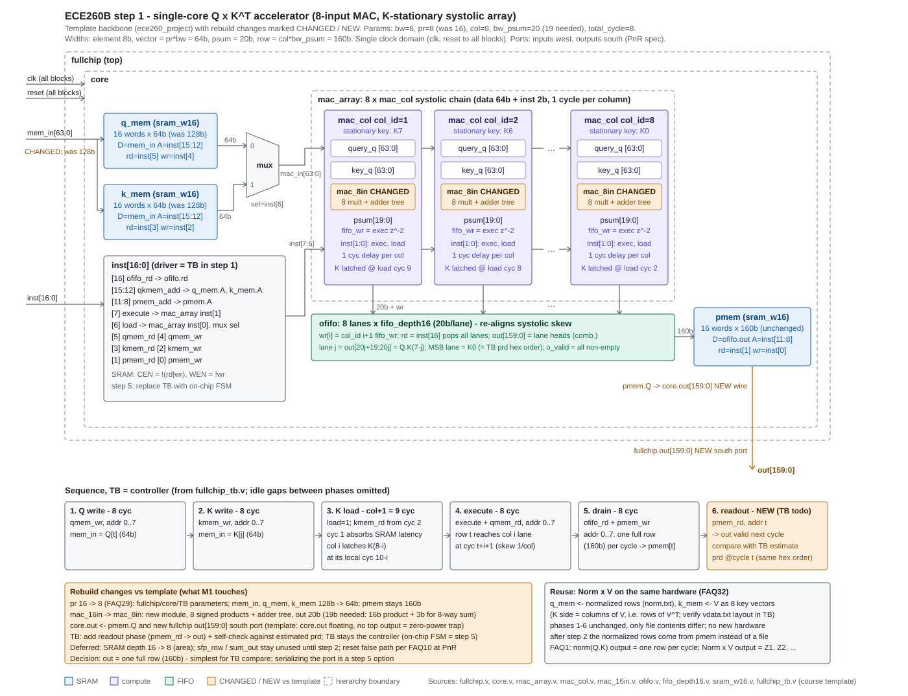

# Step 1 - Single-Core Q x K^T

First entry in the rebuild series. The course supplies a template with a 16-input MAC and
an unconnected core output; this step turns it into a working single-core matrix
multiplier, verifies it, and takes it through synthesis.

**Status: RTL, behavioral simulation and synthesis are complete. Place-and-route and
gate-level simulation are still outstanding** - the Cadence license service on the
university cluster has been unavailable since 2026-08-20, and both stages need it.
Everything below is what has been run and verified.

## What this step computes

`[Q0, Q1, ... Q7]^T * [K0, K1, ... K7]`, where every Qi and Ki is an eight-element vector
of 8-bit signed integers. One row of results per cycle: `Q0.K0 .. Q0.K7` on the first
cycle, `Q1.K0 .. Q1.K7` on the next, and so on.

## Architecture



A K-stationary systolic array. Each of the eight `mac_col` units latches one key vector
and holds it; query vectors then flow across the array, neighbour to neighbour, one column
per cycle. Each column computes an eight-element dot product and pushes it into its own
lane of the output FIFO.

The FIFO exists because of that flow: column j sees a given query vector j cycles after
column 0 does, so the eight partial results for one row arrive skewed. The FIFO absorbs
the skew and lets a complete row be written to `pmem` in a single cycle.

Widths: one element is 8 bits, one vector is `pr * bw` = 64 bits, one dot product is
`bw_psum` = 20 bits, and one row is `col * bw_psum` = 160 bits.

## What changed from the template

The template is a backbone, not a working design. Three things had to be fixed.

**The MAC is 16-input and the project needs 8.** `pr` went from 16 to 8 across
`fullchip.v`, `core.v`, `mac_array.v`, `mac_col.v` and the testbench, and `mac_8in.v` was
written to replace `mac_16in.v`. The module could not simply be re-parameterized: its body
hardcodes sixteen products, so with `pr = 8` it would index past the end of its own ports.

**The core output was not connected.** `core.out` was declared but never driven, and
`fullchip` had no output port at all. This is the trap the course spec warns about: with
nothing observable at the boundary, synthesis removes the entire design as dead logic and
reports near-zero area and power without any error. `pmem` now drives `core.out`, and
`fullchip` exports it.

**The testbench skipped data it should have read.** Both read loops began with four
`$fscanf` calls meant to discard header lines, but `qdata.txt` and `kdata.txt` have no
header - the first line is data. Left alone, those calls consume four real numbers and
shift every vector. The packing loops also wrote sixteen elements into a bus that is now
only eight elements wide.

A readout phase and a self-check were added to the testbench: after the results are
drained into `pmem`, each row is read back out through the chip output port and compared
against the value the testbench computed independently.

## Instruction encoding

| bits | name | effect |
|---|---|---|
| 16 | `ofifo_rd` | pop the output FIFO |
| 15:12 | `qkmem_add` | address for `qmem` and `kmem` |
| 11:8 | `pmem_add` | address for `pmem` |
| 7 | `execute` | run the array |
| 6 | `load` | load keys; also selects `kmem` over `qmem` at the array input |
| 5:4 | `qmem_rd`, `qmem_wr` | |
| 3:2 | `kmem_rd`, `kmem_wr` | |
| 1:0 | `pmem_rd`, `pmem_wr` | |

The testbench drives these directly. An on-chip controller is step 5 work.

## Behavioral results

```
##### RESULT: 8 PASS / 0 FAIL #####
```

All eight rows read back out of `pmem` match the expected products bit for bit. The first
row is `Q0.K0 = 93 = 0x5D`, which appears as the leading `0005d` of

```
0005dfffecffff90005efffd0fffd3fffc1fffaa
```

Simulated with Icarus Verilog, which needs no tool license.

## Synthesis results

Design Compiler Q-2019.12-SP5-3, TSMC 65nm, worst-case corner (`tcbn65gpluswc`, 0.9 V),
1.0 ns target.

| metric | value |
|---|---|
| Cell area | 148,885.20 um2 |
| Total power | 59.0083 mW (57.7193 dynamic + 1.2891 leakage) |
| Setup WNS | -0.64 ns |
| Setup TNS | -1235.51 ns over 2699 violating paths |
| Hold | 0 violations |
| Levels of logic | 17 |
| Leaf cells | 28,972 (8,624 sequential, 20,348 combinational) |
| Max transition / max capacitance violations | 0 / 0 |

Reading these numbers honestly requires three caveats.

**The SRAMs are behavioral models here, so synthesis turns them into flip-flops.** Macro
count is zero and registers account for 94.9% of the power. Turning the memories into real
macros is step 3, and the area and power profile will change completely when that happens.

**Clock network power reads as zero** because the clock is ideal at this stage. Clock tree
synthesis happens during place-and-route, and will add to the total.

**Power is a statistical estimate.** No switching activity file was annotated, so the
figure comes from default toggle rates rather than from the simulation.

`set_false_path -from [get_ports reset]` is applied in the SDC. Reset is synchronous and
fans out to every flip-flop in the design; timing it wastes optimization effort on a path
that is only released once, and it inflates the buffer tree. The constraint is confirmed
active by `report_timing_requirements`.

### What the timing numbers say

2699 violating paths at an average of about -0.46 ns is not one slow path - it is the
whole datapath being uniformly too slow. The critical path runs from a key register in one
`mac_col`, through the eight multipliers and the adder tree, into the output FIFO: 17
levels of combinational logic in a single cycle, with no pipelining anywhere.

The course spec allows step 1 to miss 1 GHz, so this is an accepted result rather than a
failure. It is also the baseline the optimization steps will be measured against, and it
points at pipelining the MAC as the first thing to try.

## Not comparable to the original project numbers

The published report for the original coursework quotes 283,408.92 um2, 580.99 mW and a
WNS of -0.070 ns. Those come from a different measurement point in every respect: dual
core rather than single, the fully optimized step 6 design rather than an unoptimized step
1, post-route rather than post-synthesis, and real SRAM macros rather than synthesized
flip-flops. The two sets of numbers should not be placed side by side.

## Files

```
step1/
  filelist              file list for the simulator
  fullchip.sdc          timing constraints, including the reset false path
  run_dc.tcl            synthesis script (PDK path comes from $COURSE_PDK_DB)
  *.txt                 input vectors supplied by the course
  verilog/
    mac_8in.v           the 8-input MAC written for this step
    core.v              memories, array, output FIFO, output port
    fullchip.v          top level
    fullchip_tb.v       testbench with the readout self-check
    ...                 remaining template modules
```

## Running it

Behavioral simulation, from this directory:

```
iverilog -g2012 -o sim.vvp -f filelist
vvp sim.vvp
gtkwave fullchip_tb.vcd
```

Synthesis needs `COURSE_PDK_DB` pointing at the directory that holds the timing library,
then from `dc_shell`:

```
source run_dc.tcl
```

Reports land in `log/`. Nothing produced by the tools is tracked in this repository.
