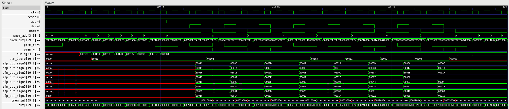
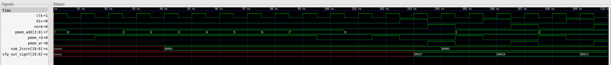

# Step 2 - Row Normalization

Second entry in the rebuild series. Step 1 produced a matrix of raw dot products in
`pmem`; this step normalizes each row in place and writes it back.

Everything here is behavioral. The course spec asks only for RTL, a waveform dump and a
simulation snapshot at this step - no synthesis and no place-and-route - so the whole step
runs under Icarus Verilog and needs no tool licenses.

## What normalization means here

Full attention would apply a softmax to each row. Exponentials are expensive in hardware,
so the course replaces the softmax with an absolute-value normalization:

```
for each row i:
    denom_i  = sum over j of |psum[i][j]|
    out[i][j] = |psum[i][j]| / (denom_i >> 7)
```

Two details are worth spelling out.

**The numerator takes the absolute value.** The template divides the signed value, which
would leave negative results. All 192 values in the provided `norm.txt`,
`norm_core0.txt` and `norm_core1.txt` are non-negative (they range from 1 to 15), and
those files are the reference input for the later `norm x V` stage. The output of this
step therefore has to be non-negative, so the numerator is taken through the same
absolute-value network as the denominator.

**The divisor is scaled down by 128.** `denom_i` is far larger than any single element, so
a plain integer divide would round almost everything to zero. Shifting the denominator
right by 7 first moves the quotient into a usable integer range. This is a fixed-point
choice, not a rounding detail - see the limits section below.

## Datapath

```
pmem -> sfp_row -> mux -> pmem
```

`sfp_row` was supplied with the course template but never instantiated. It contains:

- an absolute-value network, one per 20-bit lane
- an adder that sums the eight absolute values into a 24-bit register
- two 16-deep sum FIFOs: an internal one that feeds this core's divider, and an external
  one reserved for the second core in step 4
- eight signed dividers

A 2:1 multiplexer was added in front of the `pmem` write port so the memory can be written
either from the output FIFO (step 1) or from `sfp_row` (this step).

## The two-pass sequence

A row cannot be divided until its own sum is known, so each data set is walked twice.

**Pass A - accumulate.** Read rows 0 to 7 with `acc` high. Each cycle the eight absolute
values are summed and pushed into both FIFOs. Addresses are issued one cycle ahead of use
because `pmem` is a synchronous-read SRAM.

**Pass B - divide and write back.** Three cycles per row:

| cycle | what happens |
|---|---|
| c0 | address the row (`pmem_rd`) |
| c1 | `div` pulses high - `sfp_out` registers the divided row |
| c2 | `norm` and `pmem_wr` high - the result goes back to the same address, and the sum FIFO pops |

The FIFO is first-in first-out and pass A pushed the sums in row order, so ordering alone
pairs each row with its own sum. No index logic is needed.

### Why `div` has to be a one-cycle pulse

Inside `sfp_row` the FIFO read enable is `div_q`, which is `div` delayed by one cycle.
The FIFO output is combinational from the read pointer, so if `div` were held high across
consecutive cycles the pointer would still hold its old value when the second row was
divided, and two rows would share one sum. Pulsing `div` for a single cycle and letting
the pop land on the following cycle keeps each row paired with the correct denominator.

## Changes made in this step

- `sfp_row.v`: `reset` was used in the module body but never declared as a port. That is
  the VER-936 warning seen during step 1 synthesis. It is declared now.
- `sfp_row.v`: the dividers take the absolute value of the numerator.
- `core.v`: `sfp_row` instantiated, `sum_in` tied to zero (single core), `sum_out` routed
  to the existing core port that was reserved for it, and the `pmem` write multiplexer added.
- `core.v`, `fullchip.v`, `fullchip_tb.v`: the instruction bus grew from 17 to 20 bits.
  Step 1 already used every bit of `inst[16:0]`.

New instruction bits:

| bit | name | effect |
|---|---|---|
| 17 | `acc` | latch the sum of absolutes, push both sum FIFOs |
| 18 | `div` | divide the current row, pop the internal sum FIFO one cycle later |
| 19 | `norm` | select `sfp_out` instead of the output FIFO at the `pmem` write port |

`fifo_ext_rd` stays low here. It only matters when a second core reads the sum, in step 4.

## Results

```
##### RESULT:      8 PASS / 0 FAIL #####     <- step 1 readout, kept as a regression check
##### NORM RESULT: 8 PASS / 0 FAIL #####     <- step 2 readout
```

The testbench computes the expected normalized rows from the same input data and compares
them against what is read back out of `pmem`.

| row | sum of absolutes | divisor | normalized row |
|---|---|---|---|
| 0 | 456 | 3 | 31, 6, 2, 31, 16, 15, 21, 28 |
| 1 | 272 | 2 | 26, 10, 36, 12, 2, 16, 20, 11 |
| 2 | 285 | 2 | 19, 13, 25, 31, 14, 10, 1, 27 |
| 3 | 381 | 2 | 16, 37, 8, 62, 18, 8, 13, 25 |
| 4 | 434 | 3 | 26, 3, 3, 4, 46, 12, 30, 18 |
| 5 | 204 | 1 | 42, 1, 26, 68, 7, 7, 8, 45 |
| 6 | 263 | 2 | 9, 24, 49, 3, 0, 11, 23, 10 |
| 7 | 468 | 3 | 21, 13, 42, 15, 0, 26, 24, 12 |

The step 1 readout is deliberately left in place. Widening `inst` and adding a multiplexer
in front of the `pmem` write port both touch step 1's datapath, so every run re-checks that
the earlier step still works.

## Limits of the fixed-point scaling

The `>> 7` divisor is coarse, and the numbers above show it:

- **Row 5 has a divisor of 1.** 204 >> 7 truncates to 1, so that row is not normalized at
  all - the output is the raw absolute value. Any row whose sum is below 256 lands on a
  divisor of 0 or 1.
- **Rows 6 and 7 each contain a zero.** Where `|psum|` is smaller than the divisor, integer
  division discards the element entirely.

Neither is a defect in the rebuild; both follow from the template's scaling choice. The
shift is most likely calibrated for the dual-core case, where `sum_2core` adds the sums
from both cores and the divisor is roughly twice as large. That can be checked in step 4.

## Files

```
step2/
  filelist              file list for the simulator
  fullchip.sdc          timing constraints, carried over from step 1
  *.txt                 input vectors supplied by the course
  verilog/
    sfp_row.v           the normalizer
    core.v              instantiation, instruction decode, pmem write mux
    fullchip.v          top level
    fullchip_tb.v       testbench: both passes and both self-checks
    ...                 unchanged step 1 modules
```

## Running it

From this directory:

```
iverilog -g2012 -o sim.vvp -f filelist
vvp sim.vvp
gtkwave fullchip_tb.vcd
```

## Figures



Pass A. `acc` is held high while `sum_q` steps through the eight row sums -
0x1C8, 0x110, 0x11D, 0x17D, 0x1B2, 0xCC, 0x107, 0x1D4, which are 456, 272, 285, 381, 434,
204, 263 and 468.



Pass B, zoomed to a few rows. `div` is high for exactly one cycle out of every three, with
`pmem_rd` on the cycle before and `norm` with `pmem_wr` on the cycle after. `sum_2core`
changes as each row's divisor is popped. The contrast with pass A is visible on the left,
where `pmem_rd` is held high for eight consecutive reads.
