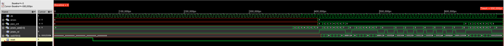
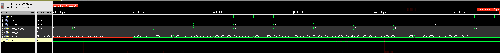
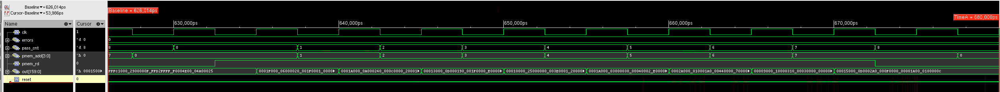

# Step 3 - Hierarchical Single Core with SRAM Macros

Third entry in the rebuild series. Steps 1 and 2 let synthesis turn the three memories
into flip-flops along with everything else. This step builds each memory as a hard
macro first - synthesized, placed, routed and abstracted on its own - and then builds
the single core around the macros, with the step 2 normalizer included.

**Status: complete as a course deliverable.** Two SRAM macros, hierarchical synthesis,
place-and-route of the core at a 1 GHz target with DRC, connectivity and antenna all
clean, and gate-level simulation of the routed netlist with all 8 rows and all 8
normalized rows correct. Timing is not closed here, which the course allows before
step 5: setup WNS is -2.151 ns and 1,090 hold violations remain. The SDF-annotated
simulation fails because of those hold violations; the last section traces that
failure to its cause, and the fix belongs to step 5.

## What this step builds

The flow runs in two stages.

**Stage A** turns one parameterized RTL memory, `sram_w16`, into two macros:
`sram_w16_sram_bit64` (16 words x 64 bits) serves both `qmem` and `kmem`, and
`sram_w16_sram_bit160` (16 words x 160 bits) serves `pmem`. Each is synthesized,
placed and routed on its own, then handed over as an abstract LEF view, a timing model
per corner, a gate netlist with SDF for simulation, and its layout.

**Stage B** synthesizes and places the chip with the three macro instances treated as
fixed cells. The top level is still `fullchip`, so the testbench is unchanged apart
from its gate-level hooks.

The macro pin specification is part of the course grading: top routing layer M4, a
4 um pin pitch, D on the bottom edge, Q on the top edge, index 0 counted from the left,
and every other pin on the left edge.

## Stage A - the SRAM macros

Design Compiler Q-2019.12-SP5-3 at the worst-case corner, then Innovus.

| | `sram_w16_sram_bit64` | `sram_w16_sram_bit160` |
|---|---|---|
| Cells (sequential) | 1,904 (1,088) | 4,575 (2,720) |
| Total cell area | 12,129.48 um2 | 30,068.64 um2 |
| Core / die | 260 x 59 / 280 x 79 um | 650 x 58 / 670 x 78 um |

The memory is a flip-flop register file: 16 words plus an output register, so 17 x
width flops. Synthesis reports the clock pin driving exactly 1,088 and 2,720 loads,
which confirms that the width parameter took effect and that no storage was optimized
away.

The die size comes from two constraints. The pin pitch puts a floor under the width:
64 pins at 4 um span 252 um and 160 pins span 636 um, so a square floorplan - about
207 um a side for the 160-bit macro - cannot hold the pins. The height then follows
from the cell area at about 80% utilization. The result is two long, thin blocks.

Two options on the abstract matter more than they look.

- `-specifyTopLayer 4` limits the obstructions in the LEF to M1-M4. Without it the
  abstract obstructs every routing layer in the technology, and the chip could not
  route over the macro at all. Both LEFs, read back, obstruct M1 through M4 only.
- `-stripePin -PGpinLayers 4` exports the M4 power stripes as power and ground pins.
  The first abstracts were written without it and had no PG pins, which would have left
  the chip nothing to connect the macro supplies to; they were regenerated with it.

The name `sram_w16_sram_bit64` is not chosen anywhere: Design Compiler builds it when
the parameterized module is elaborated. It then has to match in five places - the
netlist module, the LEF macro, the timing model cell, the Stage B link library and the
Stage B timing library set - and a mismatch in any of them either fails the link or
picks up the wrong macro.

## Stage B - synthesis with the macros as black boxes

The macros enter synthesis as port-only modules (`verilog/sram_macro_stub.v`), marked
`dont_touch` and excluded from boundary optimization. Design Compiler treats them as
black boxes and leaves the inverters on `CEN` and `WEN` outside them; place-and-route
reads the real timing models later.

**The first synthesis quietly rebuilt the memories as flip-flops.** Stage A had
analyzed `sram_w16.v` in the same directory, and its intermediate files stayed in the
work library. With the analyze line removed, elaboration still found the design there
and built it from RTL. No error was printed; the clue was the clock load, 9,085 instead
of the expected 4,192. The arithmetic closes exactly: 9,085 minus the 4,896 memory
flops (17 x (64 + 64 + 160)) leaves 4,189 core flops, and those plus the three macro
clock pins make 4,192. With the macros declared as stubs and instantiated by name, the
netlist reports 4,192, and the work library now lives where the cleanup step clears it.
Clock tree synthesis later finds the same 4,192 sinks with none unconstrained - the
three macro clock pins are in the tree.

**The step 3 copy of the RTL had lost the `sync_set_reset` directive.** Step 1 added it
to `mac_col.v`, `fifo_depth16.v` and `sfp_row.v` (see [step 1](../step1/README.md)),
but every step keeps its own copy of the sources, and this one had been started from
the course template. It was restored before the final synthesis, whose results are:

| metric | value |
|---|---|
| Core cell area | 151,799.04 um2, macros excluded |
| Total power | 43.6179 mW (42.2944 dynamic + 1.3235 leakage) |

The macros are black boxes at this point, so neither their area nor their internal
power is in these numbers; place-and-route adds them. Power is a statistical estimate
from default toggle rates. The area cannot be set against step 1's 148,885.20 um2,
which counted the memories as flip-flops and had no normalizer.

## Stage B - floorplan and place-and-route

Innovus 21.10-p004_1, 1.0 ns clock target, worst-case corner for setup and best-case
corner for hold.

The core is 690 x 698 um inside a 10 um margin (chip 710 x 718 um), and the macros set
its size: `pmem` runs along the bottom edge and `qmem` and `kmem` stack in the left
column.

- `pmem` is mirrored top to bottom (orientation `MX`), so its Q pins face the bottom
  edge. `out[159:0]` sits on that edge at the same 4 um pitch, each pin directly under
  its Q.
- `qmem` and `kmem` are rotated 90 degrees clockwise (`R270`), so their D pins face the
  west edge where the inputs arrive. `mem_in[63:0]` is centred on the channel between
  them, and `inst[15:12]`, their shared address and the start of the Stage A critical
  path, sits right above it.
- The orientation codes were measured rather than assumed: `orient_probe.tcl` places one
  instance in each of the eight orientations and reports which edge each pin lands on.

Every macro has a 10 um halo, and the standard cell rows are cut under the macros.
Power comes from an M1/M2 core ring and stripes on M5 (horizontal) and M6 (vertical);
the macros' M4 power pins are reached through the stripe vias.

**The stripe order matters.** The first run left 26 dangling wires, all on M5, all
above the `qmem`/`kmem` column, at a regular 40 um spacing. The M6 stripes, built
first, dropped stacked vias onto the macros' power pins, and the M5 landing pads those
vias left behind cut the M5 stripes; the cut fragments over the macros were then
removed as floating. Building M5 before M6 brought the count to zero.

The rest is the step 1 flow: timing-driven placement with decap fill, CCOpt clock tree
synthesis, routing, RC extraction, and post-route setup and hold optimization. The
chip GDS merges in the two macro layouts; the course PDK ships no standard-cell GDS,
so the standard cells remain references.

## Place-and-route results

| metric | value |
|---|---|
| Setup WNS / TNS | -2.151 ns / -2,274.3 ns over 2,840 of 6,824 paths |
| ... register-to-register | -2.151 ns / -2,263.3 ns over 2,695 paths |
| ... I/O paths | -0.181 ns / -11.007 ns over 145 paths |
| Hold WNS / TNS | -0.382 ns / -86.913 ns over 1,090 of 6,194 paths, all register-to-register |
| Instances | 75,388 plus 3 hard macros |
| Core / chip area | 481,620 / 509,780 um2 |
| Macro area | 96,500 um2 = 2 x (280 x 79) + (670 x 78) |
| Core density | 64.383% |
| Clock skew / insertion delay | 1.649 ns / 0.303 to 1.951 ns (4,192 sinks) |
| Congestion overflow | 0.00% H, 0.01% V |
| Total wire length | 1,281,278 um |
| Max cap / transition / fanout / length violations | 0 |

Signoff: DRC 0, connectivity 0, antenna 0.

Three of these numbers check the hierarchy itself: the macro area equals the two LEF
sizes exactly, the core and chip areas match the floorplan, and the clock tree sinks
match the synthesis clock load.

The same report prints several densities. The one quoted is
(213,579.36 + 96,500) / 481,620: standard cells without the physical-only fill, plus
the macros, over the core area. It cannot be compared with the step 1 density, which
had no macros in it.

### What the timing numbers say

The worst path starts in the normalizer's row-sum FIFO and runs through its 16:1 read
multiplexer, the row-sum adder and the divider into an `sfp_row` output register:
4.010 ns of logic in a 1.0 ns cycle. The macros are not on it. It reaches -2.151 ns
only because clock tree synthesis delayed its capture clock by 0.922 ns relative to its
launch clock - useful skew, time borrowed from the neighbouring stage, not faster
logic. Without it the slack would be about -3.07 ns.

The borrowing has a price, and it shows up as hold: 1,090 hold violations remain after
post-route optimization. Both problems point at the same fix, pipelining the datapath,
which is step 5 work; the course asks for timing closure only at step 5, on the final
dual-core design.

## Gate-level simulation

| run | netlist | delays | rows / normalized rows |
|---|---|---|---|
| RTL, same simulator invocation | RTL + macro behavioral model | none | 8/8, 8/8 |
| post-synthesis | synthesis netlist + macro gate netlists | none | 8/8, 8/8 |
| routed | flattened routed netlist + macro gate netlists | none | 8/8, 8/8 |
| routed, annotated | same | worst-case SDF | 1/8, 1/8 |

Xcelium 22.03-s001, 5 ns simulation clock. The macros are simulated with their Stage A
gate netlists; the synthesis stub must never be part of a simulation.





The readout phase of the routed, zero-delay run: `pmem` addresses step 0 through 7,
each row matches the value the testbench computed, and the pass counter reaches 8 with
zero errors. `out` reads X before the first read because the memory only updates its
output on a read, and the two counters read x until the testbench initializes them at
the start of the readout.



The same check after normalization: all eight normalized rows correct.

### Bring-up

Three problems stood between the netlist and a passing run.

**Empty macro modules shadowed the real models.** The routed simulation read one output
nibble as Z. Both netlists carry port-only modules named after the macros: synthesis
writes the stub because `write -hier` writes every design it holds, and Innovus writes
it back because `saveNetlist` includes leaf cell definitions by default. The simulator
used those empty modules instead of the Stage A netlists and said so with a `LIBNOU`
warning (library given but not used). `run_gui` now strips them into a copy under
`gls/` on every run.

**The missing `sync_set_reset`**, described above. The netlists were regenerated with
the directive and simulated with the stubs stripped, and both simulations passed. The
two changes were made together, so which of them cured the all-X output of the first
routed run was not isolated.

**A zero-delay run passed as if it were annotated.** With a sequential UDP delay floor
(`+xmseq_udp_delay`) on the command line, the elaborator printed `SDFSKPA` - it ignored
`$sdf_annotate` because of the `-nospecify` option - and the run passed with no delays
at all. The same run without the floor annotated the SDF. `run_gui` now applies the
floor only to runs without SDF, and a run that is meant to carry the SDF has to show
the SDF statistics in its log: a pass alone proves nothing about annotation.

### The annotated run: a hold race

With the SDF applied, 88.00% of path delays (253,095 of 287,604) and 42.15% of timing
checks (21,406 of 50,782) were annotated, and 1 of 8 rows came back correct, both
before and after normalization. The unannotated share is presumably inside the three
macros, whose own SDFs were not applied; the counts are consistent with that, but it
was not verified.

The run printed 9 timing check violations, all on storage registers of the output
FIFO, and they account exactly for the X digits in the readout: each violation names a
row, a column and a bit, and each lands on one of the six X digits. The other wrong
digits carry no X and raised no warning. They were stored wrong silently, so the
warning count understates the damage.

The failures have a fingerprint:

- **High bits right, low bits wrong.** Row 0, column 5 read `fff47` where `ffff9` was
  expected; row 4, column 0 read `fffc0` for `fffc8`.
- **The last row is always right.**
- **The normalized errors follow the raw ones.** Rows with X in the raw readout come
  back as X after normalization, and row 7 is right in both.

The mechanism: the FIFO stores each column's dot product, which is combinational logic
from the `mac_col` query register. The clock edge that stores row k also loads row k+1
into the query register. The low bits of the new sum take short paths through the
adder and arrive before the FIFO's clock does - the FIFO registers sit at the late end
of the clock tree, 1.50 to 1.71 ns after the edge at the clock pin - so the FIFO
stores the high bits of row k with the low bits of row k+1. Data that lands inside a
register's setup/hold window trips the check and goes X; data that lands earlier is
stored wrong without a word. The last row survives because nothing is launched behind
it.

This is a hold failure. The clock period does not enter a hold check, because the same
edge launches and captures, so slowing the simulation clock cannot fix it. These are
presumably among the paths static timing reports as hold violations, created by the
useful skew described above; that link was not cross-checked path by path. Static
timing reported hold at the best-case corner and the simulation used the worst-case
SDF. When hold is limited by clock skew rather than by a short path alone, the slower
corner tends to make it worse, not better, because the skew grows with it: 1.649 ns at
worst case against 0.598 ns at best case here.

The fix belongs to step 5 with the rest of timing closure. The note carried forward is
that hold has to close at every corner the gate-level simulation uses, not only at the
fast corner.

## Files

```
step3/
  run_dc_sram.tcl            Stage A synthesis, one macro per run ($width)
  loadDesignTech_sram.tcl    Stage A place-and-route setup ($width)
  initialFloorplan_sram.tcl  macro die sized by pin pitch and area
  pinPlacement_sram.tcl      the graded macro pin specification
  placement_sram.tcl         placement, routing held at M4
  outputGen_sram.tcl         abstract LEF, timing models, netlist, SDF, layout
  abstract_check.sh          read back a macro abstract: size, obstructions, pins
  pin_check.tcl              verify the macro pin plan: pitch, edges, index order
  run_dc.tcl                 Stage B synthesis with the macro stubs
  loadDesignTech_core.tcl    Stage B setup, macro views read from subckt/
  initialFloorplan.tcl       core size, macro placement, halos, power
  pinPlacement.tcl           chip pins lined up with the macro pins they drive
  orient_probe.tcl           measure what each orientation code does to a block
  placement.tcl, clock.tcl, route.tcl   the step 1 flow
  reportDesign.tcl           the numbers quoted above - run before outputGen
  outputGen.tcl              chip outputs, with the macro layouts merged into the GDS
  flatOut.tcl                flatten the database, rewrite netlist and SDF for simulation
  checkNetlist.tcl           checkDesign gate for the routed netlist
  run_gui                    simulation wrapper (RTL / netlist / SDF / clock knobs)
  check_setup.sh             verify the working directory before a run
  clean_pnr.sh, cmpnl.sh     carried over from step 1
  *.txt                      input vectors supplied by the course
  verilog/
    sram_w16.v               the memory, parameterized by width
    sram_macro_stub.v        port-only macros for synthesis - never simulated
    sram_macro_model.v       behavioral macros for RTL simulation
    ...                      the step 2 design and the testbench
```

## Running it

Stage A, once per macro with `width` set to 64 and then 160 at the top of
`run_dc_sram.tcl` and `loadDesignTech_sram.tcl`: `source run_dc_sram.tcl` in
`dc_shell`, then in `innovus` source `loadDesignTech_sram.tcl`,
`initialFloorplan_sram.tcl`, `pinPlacement_sram.tcl`, `placement_sram.tcl`,
`clock.tcl`, `route.tcl` and `outputGen_sram.tcl`. Copy the LEF, the WC and BC timing
models, the gate netlist and the GDS of both macros into `subckt/`.

Stage B synthesis, then check the netlist before spending place-and-route time on it:

```
source run_dc.tcl                                    (in dc_shell)
NETLIST=./netlist/fullchip.out.v NO_SDF=1 ./run_gui  (after copying the netlist)
```

Place-and-route, in `innovus`: source `loadDesignTech_core.tcl`,
`initialFloorplan.tcl`, `pinPlacement.tcl`, `placement.tcl`, `clock.tcl`, `route.tcl`,
`reportDesign.tcl`, `outputGen.tcl` and `flatOut.tcl`, in that order - the numbers
above were taken with `reportDesign` ahead of `outputGen`. Then, back in the shell:

```
NO_SDF=1 ./run_gui                   zero-delay gate-level simulation
./run_gui 2>&1 | tee gls_sdf.log     annotated; check the log for the SDF statistics
```

Nothing produced by the tools is tracked in this repository: netlists, SDF, macro views,
databases and reports all derive from the foundry libraries and stay out of the public
tree.
